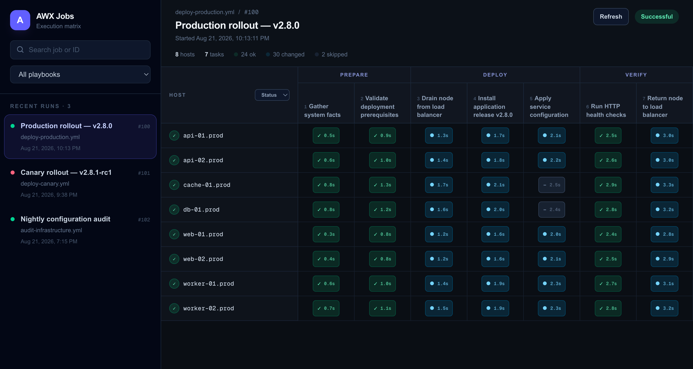
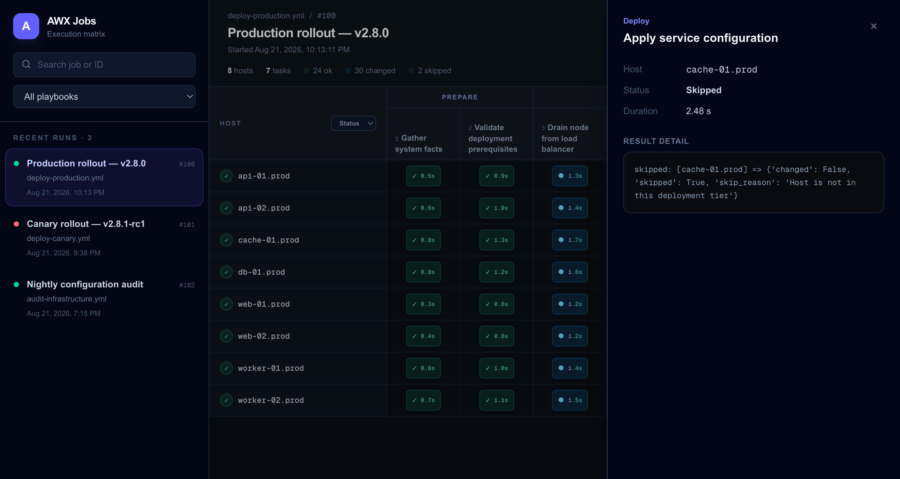

<p align="center">
  
</p>

<h1 align="center">AWX Job Visualizer</h1>

[](https://github.com/flwd3m/awx-job-visualizer/actions/workflows/ci.yml)

AWX Job Visualizer turns AWX playbook output into a compact execution matrix. See every host and task at a glance, follow running jobs live, and open individual results without digging through raw event output.

## Screenshots

### Execution matrix



### Task result details



## Features

- Playbook and workflow job support
- Host-by-task execution matrix
- Live updates for running jobs and task durations
- Clear status, duration, and changed-result indicators
- Search and playbook filters
- Detailed, ANSI-aware task output
- Server-side AWX credentials that are never exposed to the browser

Inventory updates, project updates, and other non-playbook job types are intentionally hidden.

## Quick start

Create a directory for the application and add an `.env` file:

```dotenv
AWX_URL=https://awx.example.com
AWX_TOKEN=replace-with-your-token
```

Create `compose.yaml` next to it:

```yaml
services:
  awx-job-visualizer:
    image: ghcr.io/flwd3m/awx-job-visualizer:latest
    restart: unless-stopped
    ports:
      - "3000:3000"
    env_file:
      - .env
```

Start the application:

```bash
docker compose up -d
```

Open [http://localhost:3000](http://localhost:3000).

The container validates its AWX configuration during startup. If it does not start correctly, inspect the error with:

```bash
docker compose logs awx-job-visualizer
```

## Configuration

| Variable | Required | Description |
| --- | --- | --- |
| `AWX_URL` | Yes | Complete base URL of the AWX instance, including `http://` or `https://`. |
| `AWX_TOKEN` | Recommended | AWX OAuth2 personal access token. Takes precedence over username/password authentication. |
| `AWX_USERNAME` | Alternative | AWX username. Must be supplied together with `AWX_PASSWORD` when no token is configured. |
| `AWX_PASSWORD` | Alternative | AWX password used with `AWX_USERNAME`. |
| `BASE_PATH` | No | URL prefix where the application is served, such as `/tools/awx`. Defaults to `/`. |
| `PORT` | No | Container listening port. Defaults to `3000`. |

Do not prefix these variables with `NEXT_PUBLIC_`. They are server-side secrets and should remain in your container environment or secret manager.

### Serve under a URL prefix

Set `BASE_PATH` when a reverse proxy exposes the application below a path instead of at the domain root:

```dotenv
BASE_PATH=/tools/awx
```

### Username and password authentication

If token authentication is unavailable, use:

```dotenv
AWX_URL=https://awx.example.com
AWX_USERNAME=viewer
AWX_PASSWORD=replace-with-your-password
```

## AWX access

The configured AWX account needs permission to view:

- unified jobs and their statuses;
- playbook job events;
- workflow nodes and their child jobs.

A read-only account with access to the relevant organizations, inventories, and job templates is recommended.

The AWX instance must be reachable from inside the container. HTTPS certificates must be trusted by the container; disabling TLS verification is not supported.

## Run with Docker

Docker Compose is recommended, but the container can also be started directly:

```bash
docker run -d \
  --name awx-job-visualizer \
  --restart unless-stopped \
  --publish 3000:3000 \
  --env-file .env \
  ghcr.io/flwd3m/awx-job-visualizer:latest
```

Container images are published in the [GitHub Container Registry](https://github.com/flwd3m/awx-job-visualizer/pkgs/container/awx-job-visualizer).

Images are available for `linux/amd64` and `linux/arm64`. Docker Desktop automatically selects the correct variant for Intel and Apple Silicon Macs.

## Updating

For Docker Compose installations:

```bash
docker compose pull
docker compose up -d
```

To follow a specific release instead of `latest`, replace the image tag in `compose.yaml` with the desired version.

## Troubleshooting

### The container reports a configuration error

Check that `AWX_URL` is a complete HTTP or HTTPS URL and that either `AWX_TOKEN` or both username/password variables are present. Restart the container after changing its environment.

### AWX returns 401

The token or username/password is invalid or expired. Generate a new token in AWX and update the container secret.

### AWX returns 403

The account is authenticated but cannot view one or more required AWX resources. Review its organization, job, and workflow permissions.

### No jobs appear

Only playbook jobs and workflow jobs are shown. Confirm that the account can see those jobs and that they are among the most recent AWX results.

### A workflow has no task results

The account must be able to read the workflow nodes and the playbook jobs launched by those nodes.

## Build locally

```bash
docker build --tag awx-job-visualizer:local .
docker run --rm --publish 3000:3000 --env-file .env awx-job-visualizer:local
```

The production image uses Bun on Alpine Linux, runs as a non-root user, and contains only the files traced by Next.js standalone output.

## Feedback

Found a bug or have an idea? [Open an issue](https://github.com/flwd3m/awx-job-visualizer/issues).
